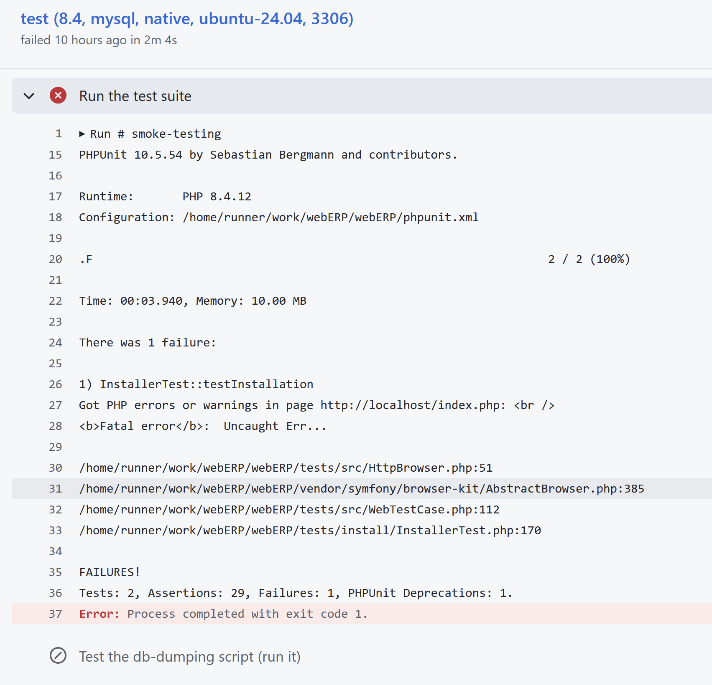
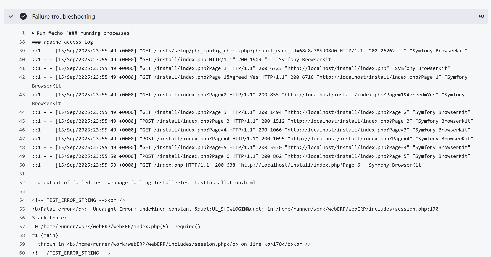

# Testing webERP

The webERP test suite consists mostly of functional tests - tests accessing the web interface rather than
driving directly the single code components. It is built using PHPUnit and the Symfony DomCrawler component.

The testsuite is run automatically on GitHub to validate every commit and pull request. It is also possible to run
tests locally to check that there are no bugs introduced before submitting a pull request.

## Understanding test failures on GitHub

To understand the cause of failures from the CI test runs, follow this process:

1. go to the lit of executions (aka. "runs") of the CI tests: https://github.com/timschofield/webERP/actions/workflows/ci.yaml

2. click on the failed run, f.e. https://github.com/timschofield/webERP/actions/runs/17749928838

3. for each run, tests are executed on a matrix of php/db combinations. In this case, tests failed for all combinations,
   so we pick the 2nd one to start our investigation, as the 1st one is on php 8.5, which is not yet released at the time
   of execution and thus experimental: https://github.com/timschofield/webERP/actions/runs/17749928838/job/50442700311

4. the job is made of many steps. You can scroll down the page and see that the failing step (red X icon) is
   "Run the test suite". Read the text in there.

   

   The interesting bit is `InstallerTest::testInstallation Got PHP errors or warnings in page http://localhost/index.php: <br /> <b>Fatal error</b>:  Uncaught Err...`

   That tells us that
   - the failing test is the one testing the installer (method `testInstallation` of class `InstallerTest`)
   - the failure happened because a php fatal error was shown when the test code requested the index.php page (this
     happens at the end of the test in fact, as the installer pages url all start with /install)
   But it is not very useful, as the error message itself is cut off. So we proceed to the next step...

5. Expand the "Failure troubleshooting" job step. It is there to give you extra details when tests fail. That's what
   you'll get:

   

   As you can see, there is a list of all the web pages which were requested by the test, and their status code,
   followed by some HTML. That HTML is the web page which triggered the test failure. In this case, the issue was
   usage of undefined constant UL_SHOWLOGIN in file session.php, line 170.

   You can continue your investigation from there...

## Local testing workflow

In order to run tests locally, it is necessary to have already set up:

* a webserver running php and configured to serve the local webERP installation
* a database (currently only mariadb and mysql are supported), which must be reachable from the webserver - note that
  if you don't have one set up, you can run one via Docker using the included scripts (see bottom of this page)
* the php command-line tool `composer`

_NB_ the test suite is not included if you have downloaded webERP from GutHub as a tarball. You need to have
gotten it via `git clone`.

There are two main modes of operation:
1. run the tests using a dedicated database schema, loaded with demo data
2. run the tests using a pre-existing webERP database schema, loaded with data of your choice

_IMPORTANT:_ When in mode 2, the data in the database will be permanently modified by the test suite. DO NOT RUN TESTS
AGAINST YOUR PRODUCTION DATABASE!

1. prerequisites: set up the webserver, php, database, and install webERP (see the installation instructions).

   Make sure you have the following PHP extensions installed and enabled:
   `bcmath, calendar, curl, ftp, gd, gettext, iconv, mbstring, mysqli, simplexml, xdebug, xml, zip, zlib`

   Make sure you have the following configuration settings in your `php.ini`:

       auto_prepend_file = (path to weberp install)/tests/setup/config/php/auto_prepend.php

   Make sure that the `composer` command is in your PATH. If not, run `sudo ./tests/setup/setup_composer.sh` to
   have it downloaded and installed in the `/usr/local/bin` folder

2. install the php test dependencies by running, in the webERP root directory, the cli command

   `./tests/setup/setup_dependencies.sh`

   Note: if the `composer` command is not in your path, or is named differently, set the env var `COMPOSER` to point
   to the correct command before running the script

   _NB:_ after running this command, the local `./vendor/` directory will be modified. Please do not commit back any of
   those changes to the `master` branch on GitHub! See step 6 below on how to undo those changes.

3. set up the test configuration for your environment: in the webERP root directory, create a file `phpunit.xml`
   with the following contents, tweaked with the correct values

	```
	<?xml version="1.0" encoding="UTF-8" ?>
	<phpunit>
		<php>
			<env name="TEST_TARGET_PROTOCOL" value="http" />
			<env name="TEST_TARGET_HOSTNAME" value="localhost" />
			<env name="TEST_TARGET_PORT" value="" />
			<env name="TEST_TARGET_BASE_URL" value="/...some path.../webERP/" />
			<env name="TEST_DB_TYPE" value="mysqli" />
			<env name="TEST_DB_HOSTNAME" value="localhost" />
			<env name="TEST_DB_PORT" value="3306" />
			<env name="TEST_DB_USER" value="root" />
			<env name="TEST_DB_PASSWORD" value="root" />
			<env name="TEST_DB_SCHEMA" value="weberp_test" />
			<env name="TEST_USER_ACCOUNT" value="admin" />
			<env name="TEST_USER_PASSWORD" value="weberp" />
			<env name="TEST_USER_EMAIL" value="admin@weberp.org" />
		</php>
	</phpunit>
	```

   _NB:_ the TEST_DB_SCHEMA might be either an existing, throw-away webERP database, prefilled with data, or
   the name of a new db schema which will be created on the fly in the next step

   _NB:_ if the tests fail with unexpected error messages, check that in the `phpunit.xml` file you have set values
   (empty strings are ok) for all the env variables defined in file `phpunit.dist.xml` - it might be that the example
   given above here has not been updated to keep track of recent developments...

4. (optional) create the test database schema and fill it with demo data: run

   `./vendor/bin/phpunit tests/install`

5. run the rest of the test suite

   `./vendor/bin/phpunit tests/run`

6. after your testing is complete, to avoid accidentally committing to git the test suite tools installed, run

   ```
   composer install --ignore-platform-reqs --no-dev --prefer-dist --optimize-autoloader
   ```

   Also, if you created a new db schema in step 4 above, feel free to drop it

   `TODO: command to be developed...`


## Writing tests

TO BE DOCUMENTED...

for the moment, look at an example in `tests/install/InstallerTest.php`


## Using the test scripts to run a specific version of a database

In short: you can _easily_ run any version of MySql and MariaDB locally, and use it for webERP.

The prerequisite is to have Docker installer.

The script to run them is `tests/setup/setup_db.sh` run it with `-h` for help.

NB: the db container does not stop once started. To stop it, run

	`docker ps`

then

	`docker stop $id`

where `$id` is the id of the container, gotten from the 1st command
